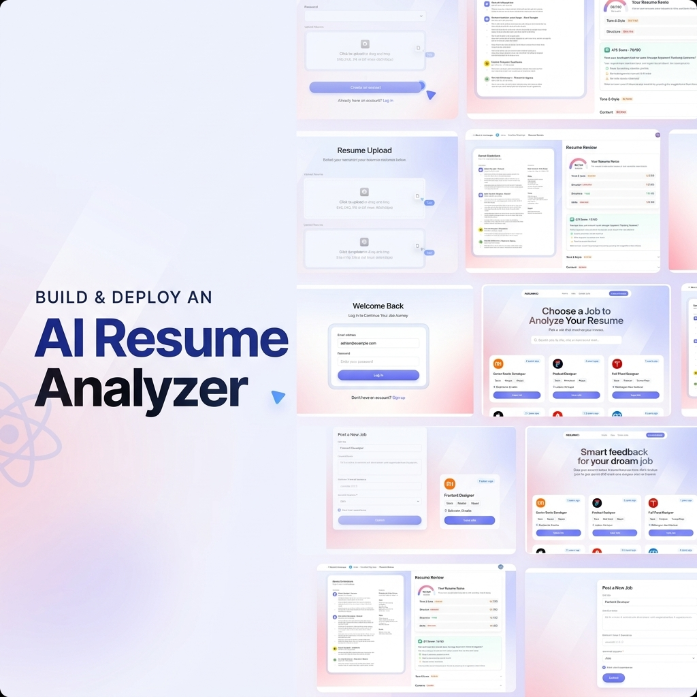

<div align="center">
  <br />
  
  <br />
  <br />

  <div>
    
    
    
    
  </div>

  <h1 align="center">AI Resume Analyzer</h1>

  <div align="center">
    A premium, modern AI-powered Resume Analyzer that helps you evaluate resumes against job descriptions, get ATS scores, and receive detailed feedback.
  </div>
</div>

## 📋 Table of Contents

1. ✨ [Introduction](#introduction)
2. ⚙️ [Tech Stack](#tech-stack)
3. 🔋 [Features](#features)
4. 🤸 [Quick Start](#quick-start)

## ✨ Introduction

An AI-powered Resume Analyzer designed to help job seekers optimize their resumes for specific job descriptions. By integrating with React, React Router, and Puter.js, this application provides seamless client-side authentication, secure resume storage, and intelligent AI matching. Get custom feedback, key skills evaluation, and ATS formatting scores tailored to each listing—all wrapped in a clean, responsive UI.

## ⚙️ Tech Stack

- **[React](https://react.dev/)** - A popular open‑source JavaScript library for building user interfaces using reusable components and a virtual DOM, enabling efficient, dynamic single-page and native apps.

- **[React Router v7](https://reactrouter.com/)** - The go‑to routing library for React apps, offering nested routes, data loaders/actions, error boundaries, code splitting, and SSR support.

- **[Puter.com](https://puter.com)** - An advanced, open-source internet operating system designed to be feature-rich, exceptionally fast, and highly extensible. Puter can be used as a privacy-first personal cloud to keep files, apps, and games in one secure place.

- **[Puter.js](https://js.puter.com)** - A tiny client‑side SDK that adds serverless auth, storage, database, and AI (GPT, Claude, DALL·E, OCR…) straight into your browser app—no backend needed.

- **[Tailwind CSS](https://tailwindcss.com/)** - A utility-first CSS framework that allows developers to design custom user interfaces by applying low-level utility classes directly in HTML.

- **[TypeScript](https://www.typescriptlang.org/)** - A superset of JavaScript that adds static typing, providing better tooling, code quality, and error detection for developers.

- **[Vite](https://vite.dev/)** - A fast build tool and dev server using native ES modules for instant startup, hot‑module replacement, and Rollup‑powered production builds.

- **[Zustand](https://github.com/pmndrs/zustand)** - A minimal, hook-based state management library for React. It lets you manage global state with zero boilerplate, no context providers, and excellent performance.

## 🔋 Features

👉 **Easy & Convenient Auth**: Handle authentication entirely in the browser using Puter.js—no backend or complex setup required.

👉 **Resume Upload & Storage**: Let users upload and store all their resumes in one place, safely and reliably.

👉 **AI Resume Matching**: Provide a job listing and get an ATS score with custom feedback tailored to each resume.

👉 **Reusable, Modern UI**: Built with clean, consistent components for a great-looking and maintainable interface.

👉 **Code Reusability**: Leverage reusable components and a modular codebase for efficient development.

👉 **Cross-Device Compatibility**: Fully responsive design that works seamlessly across all devices.

👉 **Modern UI/UX**: Clean, responsive design built with Tailwind CSS and shadcn/ui for a sleek user experience.

## 🤸 Quick Start

Follow these steps to set up the project locally on your machine.

**Prerequisites**

Make sure you have the following installed on your machine:

- [Git](https://git-scm.com/)
- [Node.js](https://nodejs.org/en)
- [npm](https://www.npmjs.com/) (Node Package Manager)

**Cloning the Repository**

```bash
git clone https://github.com/thisisfaizanali/resume-analyzer.git
cd ai-resume-analyzer
```

**Installation**

Install the project dependencies using npm:

```bash
npm install
```

**Running the Project**

```bash
npm run dev
```

Open [http://localhost:5173](http://localhost:5173) in your browser to view the project.
